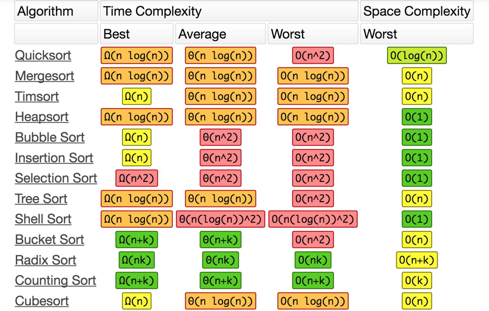

### 解释执行和编译执行

- 解释执行

 > 由解释器根据输入的数据当场执行而不生成任何的目标程序。
 
脚本语言属于解释型语言
  
- 编译执行

 > 先将源代码编译成目标语言(如:机器语言)，之后通过连接程序连接到生成的目标程序进行执行。

 
|语言类型|效率|系统依赖性|
|---|---|---|
|解释执行|低|不依赖|
|编译执行|高|依赖|

### 动态规划
背包问题 Knapsack problem

无法解决：
1. 购入连续（非离散）物品问题，例如大米或红豆，但可用贪心算法解决；
2. 在伦敦旅游时，想去巴黎景点的问题。因为伦敦至巴黎需要时间，一旦决定将卢浮宫放入背包，那么埃菲尔铁塔也将变得“便宜”，这样不满足每隔子问题离散的条件。

### 哈希表
> used to index large amounts of data

可能会出现collision,解决办法：
chaining：如果有collision，就存在linked list中
open addressing:

- linear probing: 如果被占用，则向后找到第一个可填充的位子。到end了则从start再开始。找的时候，同样linear searching
- plus 3 rehash: 这样能够避免clustering
- quadratic probing:
- double hashing

避免collision的办法：把哈希表建的比你需要的长度更长一些。
> load factor = total number of items stored / size of the array
优缺点：
linear probing在正确位置的元素个数不如chaining多，但因为遍历linked list有损耗，所以如果load factor比较低，那么linear probing更优

runtime:
Best: constant time(O(1))
Worst: linear time(O(n))

一个常见的 hash algorithm： key modulo n

1. minimize collisions
2. uniform distribution of the hash values
3. easy to calculate
4. resolve any collisions

### Sort

由于快速排序时间复杂度中的常量比归并排序更小，前者的速度会更快，因为大概率会遇到平均情况。

### Dijkstra's algorithm

对于加权图使用：

1. 找出最便宜的节点
2. 对于该节点的邻居，检查是否有前往他们的更短路径，如果有，更新其开销
3. 重复这个过程，直至更新所有节点
4. 计算最终路径

To do:

- 术语，各种术语
- 线程进程
- 垃圾回收？java?
- 分布式
- 哈希表实现
- 并行
- objects and pointers, matrix, and adjacency list
- traveling salesman and the knapsack problem （NP）
- Dijkstra and A*

Tips:

- 有的面试官注意格式
- 练习白板表达
- 即使会，也要先设计，不能直接码代码
- 可以时不时交流一下，确认在正确的方向

提前3天看对应公司的面经
面试期间要多交流
dp hard, 分类刷
